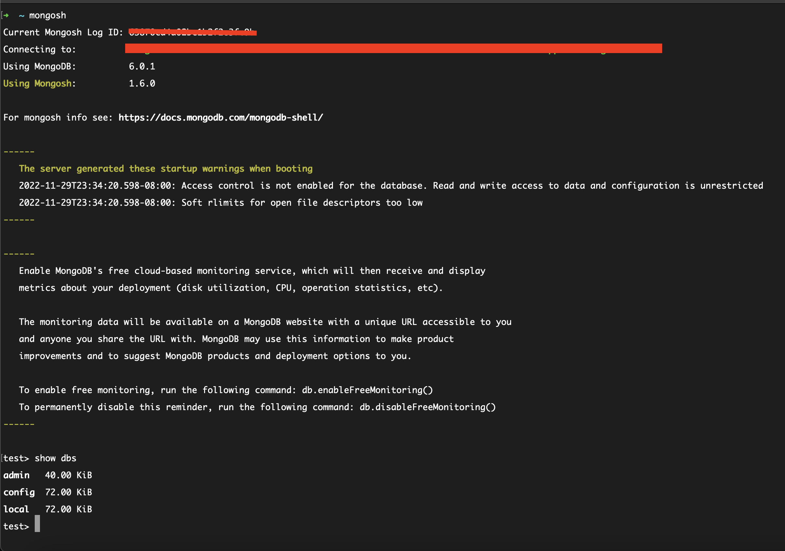

# mongo-db

## Installation
https://www.mongodb.com/docs/manual/tutorial/install-mongodb-on-os-x/


### Apple M1 Processor


| Name              | Path           |
| -------------     |:-------------:|
| configuration file      | /opt/homebrew/etc/mongod.conf |
| log directory           | /opt/homebrew/var/log/mongodb |
| data directory          | /opt/homebrew/var/mongodb |

 
 ### Start / Stop Mongo DB using homebrew

 ```shell
brew services list

brew services start mongodb-community

brew services stop mongodb-community
 ```

### Add Mongo DB to zshrc path variable

```shell
echo 'export PATH="/opt/homebrew/opt/mongodb-community@6.0/bin:$PATH"' >> ~/.zshrc

```

### Mongo.conf file location when installed through Homebrew

 ```shell
➜  etc git:(stable) pwd
/opt/homebrew/etc


➜  etc git:(stable) ls mong*
mongod.conf
```

### Download Mongodb compass from here

https://www.mongodb.com/try/download/compass


***************************************
## Note: No Mongo Shell from MongoDB version 6

Use Mongosh instead

```
brew install mongosh
```
***************************************

### Mongosh

Initiate Mongosh 

```
mongosh
```



## Mongo commands

```shell

test> show dbs
admin   40.00 KiB
config  72.00 KiB
local   72.00 KiB


test> use local
switched to db local

local> show collections
startup_log

```